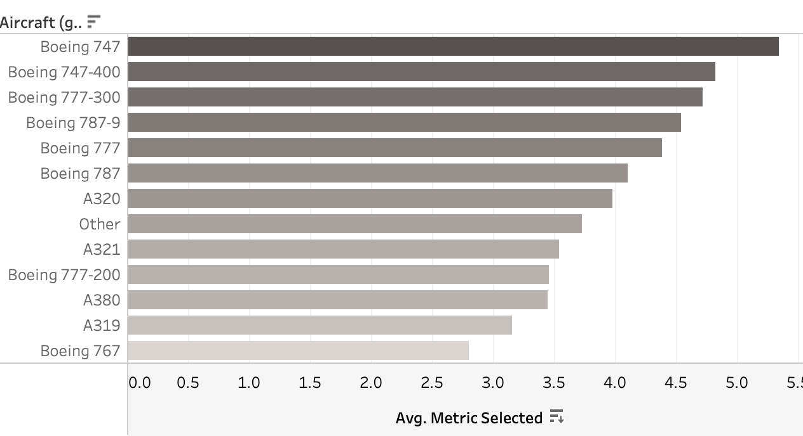

# ✈️ British Airways Reviews Dashboard (Tableau Project)

This project analyzes passenger reviews from British Airways flights to uncover insights about customer experience across different flight classes, regions, and travel types.

🔗 **[View the interactive dashboard on Tableau Public](https://public.tableau.com/app/profile/shir.shitrit/viz/BAReviews_17448289607320/Dashboard1?publish=yes)**

---

## 📌 Objectives

- Explore and visualize key trends in airline passenger reviews  
- Understand how factors like aircraft type, travel class, and customer demographics affect satisfaction  
- Practice using Tableau to create a clear and interactive dashboard

---

## 🧰 Tools & Skills Used

- **Tableau Public** – Data visualization & dashboard design  
- **Microsoft Excel** – Basic preprocessing  
- **Data Analysis** – Insight extraction, KPI analysis, visual storytelling

---

## 📁 Files Included

- `ba_reviews.csv` – Passenger review data  
- `countries.csv` – Metadata with country and region info  
- `dashboard.png` – Full dashboard screenshot  
- `insight_aircraft_rating.png` – Boeing 777-200 ratings by class  
- `insight_review_distribution.png` – Review volume by continent  
- `insight_food_by_traveltype.png` – Food ratings by travel type

---

## 🖼️ Dashboard Preview

---

## 📊 Key Insights

1. **Aircraft type impacts experience differently by class**  
   The *Boeing 747* tends to receive higher ratings from **First Class** and **Business** passengers, while **Economy** and **Premium Economy** class passengers report a less favorable experience on the same aircraft.  
   
   

3. **Europe dominates the review volume**  
   Most passenger reviews come from **European countries**, indicating that travelers from this region are the most active in providing feedback.  
   

4. **Food satisfaction varies by travel type**  
   **Couples** and **families** give consistently higher ratings for **food**, while **solo travelers** tend to rate it lower.  
   

---

## 👩‍💻 About Me

I created this project as part of a Tableau module on Data analytics course.  
It gave me hands-on experience in analyzing real-world data and building a dashboard that communicates meaningful insights clearly and interactively.

---
